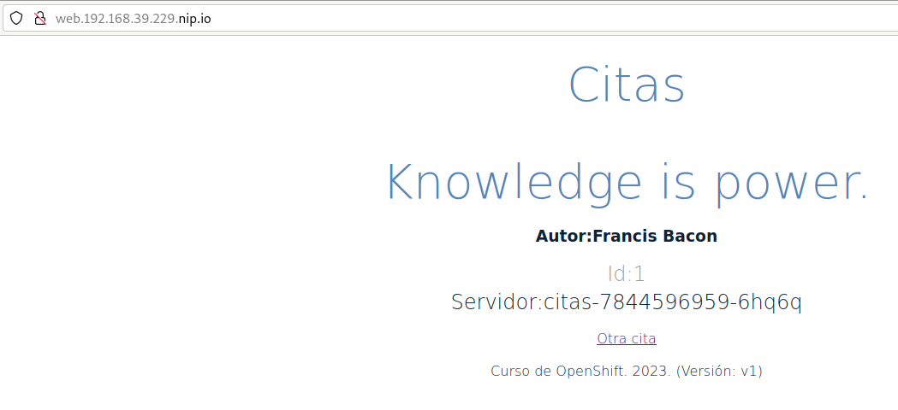

# citas-openshift

Ejemplo de aplicación para desplegarla sobre kubernetes y openshift. Este ejemplo está basado en el artículo [Learn Kubernetes using Red Hat Developer Sandbox for OpenShift](https://developers.redhat.com/developer-sandbox/activities/learn-kubernetes-using-red-hat-developer-sandbox-openshift).

## Despliegue sobre kubernetes

En este ejemplo se van a desplegar 2 microservicios (`citas-backend` y `citas-frontend`) y un servicio de base de datos mariadb. La aplicación funciona de la siguiente manera:

* `citas-backend`: Es una API RESTful que devuelve información sobre citas famosas de distintos autores famosos. La **versión 1** devuelve información de 6 citas que tiene incluidas en el programa. La **versión 2** lee la información de las citas de una base de datos guardada en un servidor mariadb. La aplicación está construida en python 3.9 y ofrece el servicio en el puerto TCP/10000.

    La API RESTful tiene los siguientes endpoints:

    * URL: `/`
        * MÉTODO: GET  
        * Devuelve la cadena "qotd" para comprobar que el servicio está funcionando.
    * URL: `/version`
        * MÉTODO: GET 
        * Devuelve una cadena con la versión de la aplicación.
    * URL: `/writtenin`
        * MÉTODO: GET
        * Devuelve una cadena con la versión de python con el que se ha programado.
    * URL: `/quotes`
        * MÉTODO: GET
        * Devuelve un JSON con todas las citas.
    * URL: `/quotes/random`
        * MÉTODO: GET
        * Devuelve un JSON con una cita elegida aleatoriamente.
    * URL: `/quotes/{id}`
        * MÉTODO: GET
        * Devuelve un JSON con la cita correspondiente al identificador indicado en la url.
* `citas-frontend`: Es una aplicación python flask que crea una página web dinámica con una cita aleatoria que lee de `citas-backend` para ello conecta al servicio RESTful usando el nombre indicado en la variable de entorno `CITAS_SERVIDOR`.

## Despliegue de la aplicación `citas-backend` versión 1

**Nota**: Para la URL usada el recurso ingress vamos a usar el dominio `nip.io` ([https://nip.io/](https://nip.io/)). De tal forma que si obtenemos la ip del nodo master, por ejemplo suponiendo que estamos trabajando con minikube:

```
minikube ip
192.168.39.229
```

La URL que usaremos en la definición del recurso ingress será `192.168.39.229.nip.io`.

Para ello ejecutamos desde directorio `citas-backend/v1/k8s` las siguientes instrucciones:

```
kubectl apply -f deployment.yaml
kubectl apply -f service.yaml
kubectl apply -f ingress.yaml
```

Podemos ver los recursos que se han creado:

```
kubectl get all,ingress
NAME                         READY   STATUS    RESTARTS   AGE
pod/citas-7844596959-6hq6q   1/1     Running   0          88s

NAME                 TYPE        CLUSTER-IP      EXTERNAL-IP   PORT(S)     AGE
service/citas        ClusterIP   10.101.211.92   <none>        10000/TCP   88s
service/kubernetes   ClusterIP   10.96.0.1       <none>        443/TCP     24m

NAME                    READY   UP-TO-DATE   AVAILABLE   AGE
deployment.apps/citas   1/1     1            1           88s

NAME                               DESIRED   CURRENT   READY   AGE
replicaset.apps/citas-7844596959   1         1         1       88s

NAME                              CLASS   HOSTS                   ADDRESS          PORTS   AGE
ingress.networking.k8s.io/citas   nginx   192.168.39.229.nip.io   192.168.39.229   80      87s
```

Este servicio será interno, es decir, no será necesario el acceso desde el exterior, pero hemos creado el recurso ingress para poder probarlo:

```
curl http://192.168.39.229.nip.io/quotes
[
  {
    "author": "Don Schenck",
    "hostname": "citas-7844596959-6hq6q",
    "id": 0,
    "quotation": "It is not only what you do, but also the attitude you bring to it, that makes you a success."
  },
  {
    "author": "Francis Bacon",
    "hostname": "citas-7844596959-6hq6q",
    "id": 1,
    "quotation": "Knowledge is power."
  },
  {
    "author": "Confucius",
    "hostname": "citas-7844596959-6hq6q",
    "id": 2,
    "quotation": "Life is really simple, but we insist on making it complicated."
  },
  {
    "author": "William Shakespeare",
    "hostname": "citas-7844596959-6hq6q",
    "id": 3,
    "quotation": "This above all, to thine own self be true."
  },
  {
    "author": "Will Ferrell",
    "hostname": "citas-7844596959-6hq6q",
    "id": 4,
    "quotation": "I got a fever, and the only prescription is more cowbell."
  },
  {
    "author": "Andrew Hendrixson",
    "hostname": "citas-7844596959-6hq6q",
    "id": 5,
    "quotation": "Anyone who has ever made anything of importance was disciplined."
  }
]
```

Por ejemplo, podemos generar una cita aleatoria:

```
curl http://192.168.39.229.nip.io/quotes/random
{
  "author": "Andrew Hendrixson",
  "hostname": "citas-7844596959-6hq6q",
  "id": 5,
  "quotation": "Anyone who has ever made anything of importance was disciplined."
}
```

Como puedes observar nos da cuatro informaciones: la cita, el autor, el identificador y el nombre de la maquina donde se está ejecutando.

## Despliegue de la aplicación `citas-frontend` 

Esta aplicación nos va a mostrar una aplicación web que hace una consulta al servicio anterior y muestra una cita aleatoria en pantalla. En realidad no es necesario que el la aplicación `citas-abackend` sea accesible desde el exterior, es suficiente el haber creado el recurso service de tipo ClusterIP apra que esta aplicación pueda acceder a ella, por lo tanto vamos a eliminar el ingress creado anteriormente:

```
kubectl delete ingress.networking.k8s.io/citas
```

A continuación desplegamos la aplicación, creando un deployment, un service y un ingress (la URL de este ingress será `web.192.168.39.229.nip.io`). Para ello desde el directorio `citas-frontend/k8s` ejecutamos:

```
kubectl apply -f deployment.yaml
kubectl apply -f service.yaml
kubectl apply -f ingress.yaml
```

Y comprobamos los recursos que tenemos en este momento:

```
kubectl get all,ingress
NAME                            READY   STATUS    RESTARTS   AGE
pod/citas-7844596959-6hq6q      1/1     Running   0          12m
pod/citasweb-5b58c6d6d7-d4tv5   1/1     Running   0          75s

NAME                 TYPE        CLUSTER-IP      EXTERNAL-IP   PORT(S)                      AGE
service/citas        ClusterIP   10.101.211.92   <none>        10000/TCP                    12m
service/citasweb     ClusterIP   10.105.60.35    <none>        5000/TCP,8443/TCP,8778/TCP   72s
service/kubernetes   ClusterIP   10.96.0.1       <none>        443/TCP                      36m

NAME                       READY   UP-TO-DATE   AVAILABLE   AGE
deployment.apps/citas      1/1     1            1           12m
deployment.apps/citasweb   1/1     1            1           75s

NAME                                  DESIRED   CURRENT   READY   AGE
replicaset.apps/citas-7844596959      1         1         1       12m
replicaset.apps/citasweb-5b58c6d6d7   1         1         1       75s

NAME                                 CLASS   HOSTS                       ADDRESS          PORTS   AGE
ingress.networking.k8s.io/citasweb   nginx   web.192.168.39.229.nip.io   192.168.39.229   80      69s
```

Y si accedemos la URL del ingress podemos acceder a la aplicación:



Como podemos observar, además de los datos de la cita, también se muestra la versión de `citas-backend` que está ofreciendo la información.

### Escalando la aplicación `citas-backend`

Podemos escalar cualquiera de los dos despliegues que hemos realizado. En este caso vamos a escalar el número de pods del despliegue de `citas-backend` y podremos observar como en la información que se muestra en la página web va cambiado el nombre del hostname demostrando, de esta manera, que se esta balanceando la carga entre los pods del despliegue:

```
kubectl scale deployment.apps/citas --replicas=3
```

Y vemos los nuevos pods que se han creado:

```
kubectl get pod
NAME                        READY   STATUS    RESTARTS   AGE
citas-7844596959-6hq6q      1/1     Running   0          21m
citas-7844596959-d5tfg      1/1     Running   0          5s
citas-7844596959-x2ckl      1/1     Running   0          5s
citasweb-5b58c6d6d7-d4tv5   1/1     Running   0          10m
```

Y si accedemos a la página web y vamos refrescando, observamos como se balancea la carga entre los distintos pods:


